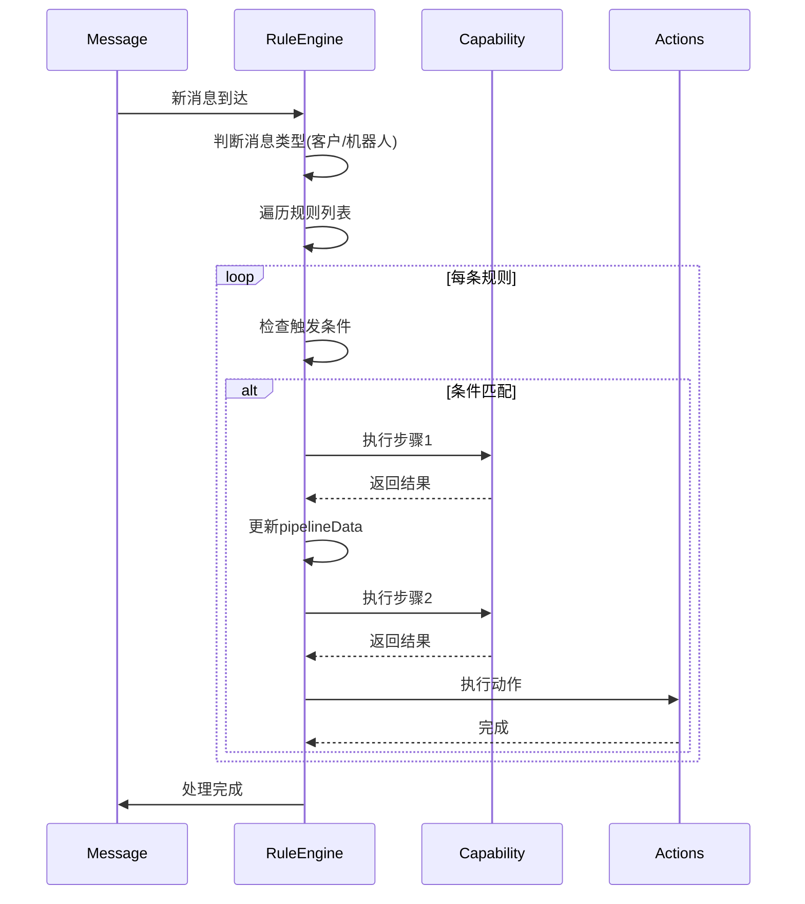

# 客服规则引擎 - 技术方案文档

> **版本**: v1.0
> **最后更新**: 2025-12-08
> **状态**: 待评审

---

## 📋 目录

- [1. 项目背景](#1-项目背景)
- [2. 核心需求](#2-核心需求)
- [3. 技术选型](#3-技术选型)
- [4. 架构设计](#4-架构设计)
- [5. 能力库设计](#5-能力库设计)
- [6. 数据模型](#6-数据模型)
- [7. 实施计划](#7-实施计划)
- [8. 风险与缓解](#8-风险与缓解)

---

## 1. 项目背景

### 1.1 当前痛点

Telegram Web 客服功能当前存在以下限制:

1. **过滤规则固化**: 只支持 `monitoredChatIds`、`filteredUserIds`、`regexFilters` 三种简单规则
2. **无法监听机器人回复**: 当 AI 机器人回复客户后,无法根据回复内容智能决策(如自动标记已读)
3. **缺乏自动化能力**: 无法实现 OCR 识别→API 查询→自动回复等复杂链路
4. **扩展性差**: 新增业务逻辑需要修改核心代码

### 1.2 典型场景

| 场景 | 当前实现 | 期望实现 |
|-----|---------|---------|
| **AI 辅助决策** | ❌ 无法监听 AI 回复 | ✅ AI 说"已解决"自动标记已读 |
| **OCR 自动查单** | ❌ 需手动处理 | ✅ 识别图片→提取单号→查询→回复 |
| **消息去重** | ✅ 支持(硬编码) | ✅ 支持(可配置化) |
| **VIP 优先处理** | ❌ 无法实现 | ✅ 根据用户等级动态决策 |

---

## 2. 核心需求

### 2.1 功能需求

#### FR1: 双向消息监听
- 监听**客户消息**(当前已支持)
- 监听**机器人回复消息**(新增)
- 支持针对不同消息类型配置不同处理规则

#### FR2: 可配置化规则系统
- 用户可通过配置文件定义规则,无需修改代码
- 支持条件判断(文本匹配、用户属性、消息属性等)
- 支持多种动作(标记已读、自动回复、添加到队列等)

#### FR3: 能力插件化
- 将常见能力抽象为可复用组件:
  - **检测类**: 回复检测、文本匹配、用户过滤
  - **提取类**: OCR 识别、正则提取、API 调用
  - **动作类**: 标记已读、自动回复、添加队列
- 用户可自由组合能力构建处理流程

#### FR4: 链式处理管道
- 规则支持多步骤处理(Pipeline)
- 步骤间数据传递(前一步输出作为后一步输入)
- 支持条件路由(成功/失败不同分支)

### 2.2 非功能需求

#### NFR1: 性能
- 单条消息处理时间 < 100ms(不含异步 API 调用)
- 支持规则缓存,避免重复解析

#### NFR2: 安全性
- 禁止不安全的代码执行(如 `eval`)
- 用户配置需校验合法性
- 外部 API 调用需超时控制

#### NFR3: 可维护性
- 代码模块化,单一职责
- 能力库易扩展(新增能力无需改引擎)
- 完整的类型定义(TypeScript)

#### NFR4: 向后兼容
- 保留现有三种过滤规则的支持
- 平滑迁移路径(可选启用新规则)

---

## 3. 技术选型

### 3.1 方案对比

我们调研了以下技术方案:

| 方案 | 优点 | 缺点 | 推荐度 |
|-----|------|------|--------|
| **json-rules-engine** | 成熟稳定,功能完整 | 需引入 50KB 依赖,学习成本中 | ⭐⭐⭐⭐ |
| **expr-eval** | 轻量(20KB),安全无 eval | 功能有限,仅支持表达式 | ⭐⭐⭐⭐⭐ |
| **quickjs-emscripten** | 完全沙箱,可执行任意 JS | 体积大(1MB),复杂度高 | ⭐⭐ |
| **自研轻量 DSL** | 零依赖,完全可控 | 需自行维护解析器 | ⭐⭐⭐⭐⭐ |

### 3.2 最终选型

**核心引擎**: 自研能力插件化架构(~500 行代码)
**条件评估**: expr-eval(表达式模式) + Function(高级模式,可选)
**依赖体积**: ~20KB(仅 expr-eval)

#### 选型理由

1. **符合项目规范**: CLAUDE.md 明确要求"No new libraries",expr-eval 是最小必要依赖
2. **灵活性**: 能力插件化架构比纯规则引擎更灵活,适合复杂业务场景
3. **扩展性**: 新增能力只需实现 `Capability` 接口,无需改引擎代码
4. **可维护性**: 每个能力独立,易于测试和调试
5. **性能**: 表达式可编译为 JS 函数,性能优于纯解释执行

### 3.3 技术栈

```
├── 核心引擎 (自研)
│   ├── 能力注册表
│   ├── 管道执行器
│   └── 条件路由器
├── 条件评估器
│   ├── expr-eval (表达式模式)
│   └── Function (JS 模式,可选)
├── 内置能力库
│   ├── 检测类能力 (5个)
│   ├── 提取类能力 (3个)
│   └── 动作类能力 (4个)
└── UI 配置界面
    ├── 规则列表 (React)
    ├── 拖拽编辑器 (可选)
    └── 测试面板
```

---

## 4. 架构设计

### 4.1 整体架构

```
┌─────────────────────────────────────────────────────────┐
│                    消息入口层                             │
│         (apiUpdaters/messages.ts)                       │
│                                                          │
│  监听: newMessage / updateMessage / deleteMessage       │
└────────────────────┬────────────────────────────────────┘
                     │
                     ▼
┌─────────────────────────────────────────────────────────┐
│                  规则引擎调度层                           │
│            (helpers/ruleEngine.ts)                      │
│                                                          │
│  1. 加载用户配置的规则列表                                │
│  2. 检查触发条件(eventType/chatIds/senderIds)          │
│  3. 执行匹配规则的处理管道                                │
└────────────────────┬────────────────────────────────────┘
                     │
                     ▼
┌─────────────────────────────────────────────────────────┐
│                  能力执行层                               │
│         (helpers/capabilities/*.ts)                     │
│                                                          │
│  ┌──────────────┐  ┌──────────────┐  ┌──────────────┐ │
│  │ 检测类能力    │  │ 提取类能力    │  │ 动作类能力    │ │
│  │              │  │              │  │              │ │
│  │ • 文本匹配   │  │ • OCR识别    │  │ • 标记已读   │ │
│  │ • 回复检测   │  │ • API调用    │  │ • 自动回复   │ │
│  │ • 用户过滤   │  │ • 正则提取   │  │ • 添加队列   │ │
│  └──────────────┘  └──────────────┘  └──────────────┘ │
└────────────────────┬────────────────────────────────────┘
                     │
                     ▼
┌─────────────────────────────────────────────────────────┐
│                  数据持久层                               │
│       (global.customerServiceV2.settings)               │
│                                                          │
│  • 规则配置存储                                          │
│  • 自动同步 IndexedDB                                   │
│  • 可选云端同步(Redis)                                   │
└─────────────────────────────────────────────────────────┘
```

### 4.2 核心流程

#### 流程1: 新消息处理



#### 流程2: 规则执行详细流程

```
输入: message, rule
输出: 执行结果

1. 初始化 pipelineData = { message, text, senderId, ... }

2. for step in rule.pipeline:
     a. 获取能力: capability = registry.get(step.capabilityId)

     b. 执行能力:
        result = await capability.execute({
          message,
          config: step.config,
          pipelineData,  // 前面步骤的累积数据
          global,
          actions
        })

     c. 合并输出:
        pipelineData = { ...pipelineData, ...result.data }

     d. 路由决策:
        if result.success:
          - 执行 onSuccess.executeAction
          - 判断是否 continueNext
        else:
          - 执行 onFailure.executeAction
          - 判断是否 stopPipeline

3. 返回最终 pipelineData
```

### 4.3 模块划分

```
src/global/
├── types/
│   └── customerServiceV2.ts       # 类型定义(扩展)
│       ├── Capability
│       ├── UserRule
│       └── CapabilityInput/Output
│
├── helpers/
│   ├── ruleEngine.ts              # 核心引擎(150行)
│   │   ├── registerCapability()
│   │   ├── executeRule()
│   │   └── processMessageWithRules()
│   │
│   ├── capabilities/              # 能力库(新增文件夹)
│   │   ├── index.ts              # 能力导出
│   │   ├── checkers.ts           # 检测类能力
│   │   ├── extractors.ts         # 提取类能力
│   │   └── actions.ts            # 动作类能力
│   │
│   └── templateRenderer.ts        # 模板渲染工具
│
└── actions/
    └── apiUpdaters/
        └── messages.ts            # 消息更新处理(修改)
            └── 集成规则引擎调用

src/components/
└── customerService/v2/setting/
    └── tabs/
        ├── RulesTab.tsx           # 规则管理界面(新增)
        ├── RuleEditor.tsx         # 规则编辑器(新增)
        └── PipelineCanvas.tsx     # 流程画布(可选)
```

---

## 5. 能力库设计

### 5.1 能力接口定义

```typescript
// src/global/types/customerServiceV2.ts

/**
 * 能力类型
 */
export type CapabilityType = 'checker' | 'extractor' | 'action';

/**
 * 能力配置定义
 */
export type CapabilityConfigSchema = {
  [key: string]: {
    type: 'string' | 'number' | 'boolean' | 'select' | 'textarea';
    label: string;
    default?: any;
    options?: string[];  // for select type
    placeholder?: string;
    required?: boolean;
  };
};

/**
 * 能力执行输入
 */
export type CapabilityInput = {
  message: ApiMessage;
  config: Record<string, any>;
  global: GlobalState;
  actions: any;
  pipelineData: Record<string, any>;  // 前面步骤的累积数据
};

/**
 * 能力执行输出
 */
export type CapabilityOutput = {
  success: boolean;
  data?: Record<string, any>;  // 输出数据,会合并到pipelineData
  error?: string;
};

/**
 * 能力定义
 */
export type Capability = {
  id: string;
  name: string;
  type: CapabilityType;
  description?: string;

  // 配置参数定义(用于UI自动生成表单)
  configSchema: CapabilityConfigSchema;

  // 能力执行函数
  execute: (input: CapabilityInput) => Promise<CapabilityOutput>;
};
```

### 5.2 内置能力清单

#### 5.2.1 检测类能力 (Checkers)

| 能力ID | 名称 | 描述 | 配置参数 |
|-------|------|------|---------|
| `check_has_reply` | 回复检测 | 检查消息是否已被回复 | `timeWindow`: 时间窗口(秒) |
| `check_text_match` | 文本匹配 | 检查消息文本是否匹配条件 | `pattern`: 匹配模式<br>`mode`: 包含/正则/完全相等 |
| `check_user_level` | 用户等级检测 | 检查发送者用户等级 | `minLevel`: 最低等级<br>`operator`: >=, >, ==, <, <= |
| `check_has_media` | 媒体检测 | 检查消息是否包含媒体 | `mediaType`: photo/video/document/any |
| `check_is_forwarded` | 转发检测 | 检查消息是否为转发 | 无 |

#### 5.2.2 提取类能力 (Extractors)

| 能力ID | 名称 | 描述 | 配置参数 |
|-------|------|------|---------|
| `extract_ocr` | OCR识别 | 从图片中识别文字 | `language`: 识别语言<br>`extractPattern`: 提取正则(可选) |
| `extract_regex` | 正则提取 | 从文本中提取匹配内容 | `pattern`: 正则表达式<br>`group`: 捕获组索引 |
| `call_api` | API调用 | 调用外部HTTP API | `url`: API地址<br>`method`: GET/POST<br>`bodyTemplate`: 请求体模板 |

#### 5.2.3 动作类能力 (Actions)

| 能力ID | 名称 | 描述 | 配置参数 |
|-------|------|------|---------|
| `action_mark_read` | 标记已读 | 从客服队列移除消息 | `targetMessage`: 当前消息/回复的原消息 |
| `action_auto_reply` | 自动回复 | 发送自动回复消息 | `template`: 回复模板(支持变量) |
| `action_add_queue` | 添加到队列 | 添加消息到客服队列 | 无 |
| `action_notify` | 发送通知 | 向客服人员发送通知 | `message`: 通知内容模板 |

### 5.3 能力实现示例

```typescript
// src/global/helpers/capabilities/checkers.ts

export const textMatchCapability: Capability = {
  id: 'check_text_match',
  name: '文本匹配检测',
  type: 'checker',
  description: '检查消息文本是否匹配指定条件',

  configSchema: {
    pattern: {
      type: 'string',
      label: '匹配模式',
      placeholder: '输入关键词或正则表达式',
      required: true,
    },
    mode: {
      type: 'select',
      label: '匹配方式',
      options: ['包含', '正则', '完全相等'],
      default: '包含',
    },
  },

  async execute({ message, config, pipelineData }) {
    const text = pipelineData.text || getMessageText(message)?.text || '';

    let matched = false;
    const { pattern, mode } = config;

    try {
      if (mode === '包含') {
        matched = text.includes(pattern);
      } else if (mode === '正则') {
        matched = new RegExp(pattern).test(text);
      } else if (mode === '完全相等') {
        matched = text === pattern;
      }
    } catch (error) {
      return {
        success: false,
        error: `Pattern matching failed: ${error.message}`,
      };
    }

    return {
      success: matched,
      data: {
        matched,
        matchedText: matched ? text : undefined,
      },
    };
  },
};
```

---

## 6. 数据模型

### 6.1 核心类型定义

```typescript
// src/global/types/customerServiceV2.ts (扩展)

/**
 * 用户配置的规则
 */
export type UserRule = {
  id: string;
  name: string;
  enabled: boolean;
  priority?: number;  // 规则优先级(数字越大越优先,默认0)

  // 触发条件
  trigger: {
    eventType: 'customer_message' | 'bot_reply' | 'any_message';
    chatIds?: string[];   // 限定哪些群组(空=所有监控群组)
    senderIds?: string[]; // 限定哪些发送者(空=所有)
  };

  // 处理管道(按顺序执行)
  pipeline: Array<PipelineStep>;
};

/**
 * 管道步骤
 */
export type PipelineStep = {
  id: string;  // 步骤唯一ID(用于goto路由)
  capabilityId: string;  // 引用的能力ID
  config: Record<string, any>;  // 用户配置的参数

  // 成功时的路由
  onSuccess?: {
    continueNext?: boolean;  // 是否继续下一步(默认true)
    gotoStep?: string;       // 跳转到指定步骤ID
    executeAction?: string;  // 执行指定动作能力ID
  };

  // 失败时的路由
  onFailure?: {
    stopPipeline?: boolean;  // 是否停止管道(默认false)
    gotoStep?: string;
    executeAction?: string;
  };
};

/**
 * 扩展 CustomerServiceSettings
 */
export type CustomerServiceSettings = {
  // ... 现有字段 ...

  /**
   * 新增: 规则列表
   */
  rules?: UserRule[];

  /**
   * 新增: 规则引擎配置
   */
  ruleEngineConfig?: {
    enabled: boolean;  // 是否启用规则引擎
    fallbackToLegacy: boolean;  // 无规则匹配时是否使用旧逻辑
    maxExecutionTime: number;  // 单条规则最大执行时间(ms)
  };
};
```

### 6.2 配置示例

#### 示例1: AI辅助决策规则

```json
{
  "id": "rule_ai_auto_resolve",
  "name": "AI解决问题自动已读",
  "enabled": true,
  "priority": 10,
  "trigger": {
    "eventType": "bot_reply",
    "senderIds": ["bot_ai_assistant"]
  },
  "pipeline": [
    {
      "id": "step1_check_text",
      "capabilityId": "check_text_match",
      "config": {
        "pattern": "已为您解决|问题已处理|已帮您查询",
        "mode": "正则"
      },
      "onSuccess": {
        "continueNext": true
      },
      "onFailure": {
        "stopPipeline": true
      }
    },
    {
      "id": "step2_mark_read",
      "capabilityId": "action_mark_read",
      "config": {
        "targetMessage": "回复的原消息"
      }
    }
  ]
}
```

#### 示例2: OCR自动查单规则

```json
{
  "id": "rule_ocr_order_query",
  "name": "OCR自动查单",
  "enabled": true,
  "priority": 5,
  "trigger": {
    "eventType": "customer_message",
    "chatIds": ["-1001234567890"]
  },
  "pipeline": [
    {
      "id": "step1_check_media",
      "capabilityId": "check_has_media",
      "config": {
        "mediaType": "photo"
      },
      "onFailure": {
        "stopPipeline": true
      }
    },
    {
      "id": "step2_check_keyword",
      "capabilityId": "check_text_match",
      "config": {
        "pattern": "单号|订单|查单",
        "mode": "包含"
      },
      "onFailure": {
        "stopPipeline": true
      }
    },
    {
      "id": "step3_ocr",
      "capabilityId": "extract_ocr",
      "config": {
        "language": "chi_sim+eng",
        "extractPattern": "[A-Z]{2}\\d{10,15}"
      },
      "onFailure": {
        "executeAction": "action_auto_reply",
        "stopPipeline": true
      }
    },
    {
      "id": "step4_query_api",
      "capabilityId": "call_api",
      "config": {
        "url": "https://api.internal.com/order/query",
        "method": "POST",
        "bodyTemplate": "{\"orderId\": \"{{extracted}}\"}"
      }
    },
    {
      "id": "step5_reply",
      "capabilityId": "action_auto_reply",
      "config": {
        "template": "订单号: {{extracted}}\n状态: {{apiResponse.status}}\n物流: {{apiResponse.tracking}}"
      }
    }
  ]
}
```

### 6.3 存储结构

```typescript
// GlobalState 结构
global.customerServiceV2 = {
  settings: {
    // ... 现有字段 ...

    rules: [
      { /* rule1 */ },
      { /* rule2 */ },
    ],

    ruleEngineConfig: {
      enabled: true,
      fallbackToLegacy: true,
      maxExecutionTime: 5000,
    }
  }
}

// IndexedDB 自动同步
// localStorage 备份(可选)
// Redis 云端同步(可选,复用现有 customerServiceSync.ts)
```

---

## 7. 实施计划

### 7.1 阶段划分

#### Phase 1: 核心引擎 MVP (3天)

**目标**: 实现基础规则引擎,验证可行性

**任务清单**:
- [ ] 定义核心类型 (`Capability`, `UserRule`, `PipelineStep`)
- [ ] 实现规则引擎核心逻辑
  - [ ] 能力注册表
  - [ ] 管道执行器
  - [ ] 条件路由器
- [ ] 实现3个基础能力
  - [ ] `check_text_match` (文本匹配)
  - [ ] `action_mark_read` (标记已读)
  - [ ] `action_auto_reply` (自动回复)
- [ ] 集成到消息更新流程
- [ ] 编写单元测试

**验收标准**:
- ✅ 能正确执行简单规则(1-2步)
- ✅ 支持条件路由(成功/失败分支)
- ✅ 与现有过滤逻辑兼容

#### Phase 2: 完整能力库 (4天)

**目标**: 实现所有内置能力

**任务清单**:
- [ ] 实现检测类能力(5个)
- [ ] 实现提取类能力(3个)
- [ ] 实现动作类能力(4个)
- [ ] 实现模板渲染器(支持 `{{变量}}` 语法)
- [ ] 添加能力单元测试
- [ ] 编写能力使用文档

**验收标准**:
- ✅ 所有能力通过单元测试
- ✅ 能实现文档中的所有示例场景
- ✅ 模板变量正确替换

#### Phase 3: UI配置界面 (5天)

**目标**: 让用户可视化配置规则

**任务清单**:
- [ ] 创建规则管理界面 (`RulesTab.tsx`)
  - [ ] 规则列表(启用/禁用/编辑/删除)
  - [ ] 规则排序(拖拽调整优先级)
- [ ] 创建规则编辑器 (`RuleEditor.tsx`)
  - [ ] 触发条件配置
  - [ ] 管道步骤编辑器
  - [ ] 能力配置表单(根据 `configSchema` 自动生成)
  - [ ] 步骤路由配置
- [ ] 规则测试功能
  - [ ] 选择历史消息测试
  - [ ] 显示执行日志
- [ ] 规则导入/导出(JSON格式)

**验收标准**:
- ✅ 用户可通过UI完成所有规则配置
- ✅ 表单校验正确(必填项、格式检查)
- ✅ 测试功能可正常工作

#### Phase 4: 优化与文档 (2天)

**目标**: 性能优化和完善文档

**任务清单**:
- [ ] 性能优化
  - [ ] 规则编译缓存
  - [ ] 异步能力超时控制
  - [ ] 错误恢复机制
- [ ] 编写用户文档
  - [ ] 快速入门指南
  - [ ] 能力参考手册
  - [ ] 常见场景示例
- [ ] 代码重构
  - [ ] 遵循项目代码规范
  - [ ] 添加注释和类型标注
- [ ] 集成测试

**验收标准**:
- ✅ 单条消息处理时间 < 100ms
- ✅ 文档完整,易于理解
- ✅ 代码通过 ESLint 检查

### 7.2 时间估算

| 阶段 | 工作量 | 开始日期 | 结束日期 |
|-----|--------|---------|---------|
| Phase 1 | 3人天 | D+0 | D+3 |
| Phase 2 | 4人天 | D+3 | D+7 |
| Phase 3 | 5人天 | D+7 | D+12 |
| Phase 4 | 2人天 | D+12 | D+14 |
| **总计** | **14人天** | - | **~3周** |

### 7.3 里程碑

- **M1 (D+3)**: MVP完成,核心引擎可用
- **M2 (D+7)**: 能力库完整,覆盖所有场景
- **M3 (D+12)**: UI配置界面完成,用户可自主配置
- **M4 (D+14)**: 优化完成,正式发布

---

## 8. 风险与缓解

### 8.1 技术风险

| 风险 | 概率 | 影响 | 缓解措施 |
|-----|------|------|---------|
| **expr-eval表达式能力有限** | 中 | 中 | 提供JS模式作为备选,或自研表达式解析器 |
| **异步能力性能问题** | 中 | 高 | 添加超时控制(默认5s),失败降级到队列 |
| **规则配置错误导致系统异常** | 高 | 高 | 完善表单校验,测试功能,沙箱执行 |
| **能力库扩展困难** | 低 | 中 | 保持接口简洁,提供能力开发模板 |

### 8.2 业务风险

| 风险 | 概率 | 影响 | 缓解措施 |
|-----|------|------|---------|
| **用户学习成本高** | 高 | 中 | 提供预设模板,可视化编辑器,详细文档 |
| **规则冲突** | 中 | 中 | 支持规则优先级,执行日志可追溯 |
| **旧功能兼容性** | 低 | 高 | 保留旧过滤逻辑,fallbackToLegacy选项 |
| **配置数据丢失** | 低 | 高 | 多重备份(IndexedDB + localStorage + Redis) |

### 8.3 安全风险

| 风险 | 概率 | 影响 | 缓解措施 |
|-----|------|------|---------|
| **恶意配置攻击** | 低 | 高 | 仅管理员可配置规则,校验所有输入 |
| **外部API泄露数据** | 中 | 高 | HTTPS限制,敏感数据脱敏,审计日志 |
| **JS代码注入** | 低 | 高 | 默认禁用JS模式,启用需明确警告 |

---

## 附录

### A. 术语表

| 术语 | 定义 |
|-----|------|
| **能力(Capability)** | 可复用的功能模块,分为检测/提取/动作三类 |
| **规则(Rule)** | 用户配置的消息处理流程,包含触发条件和管道步骤 |
| **管道(Pipeline)** | 多个能力按顺序组合的处理流程 |
| **管道数据(PipelineData)** | 管道执行过程中累积的数据,供后续步骤使用 |
| **条件路由** | 根据步骤执行结果决定下一步走向 |

### B. 参考资料

- [json-rules-engine](https://github.com/CacheControl/json-rules-engine)
- [expr-eval](https://github.com/silentmatt/expr-eval)
- [quickjs-emscripten](https://github.com/justjake/quickjs-emscripten)
- [JSONPath](https://github.com/dchester/jsonpath)

### C. 联系方式

如有技术问题,请联系:
- **技术负责人**: [待填写]
- **项目仓库**: /home/aton/IdeaProjects/telegram-tt

---

**文档结束**
